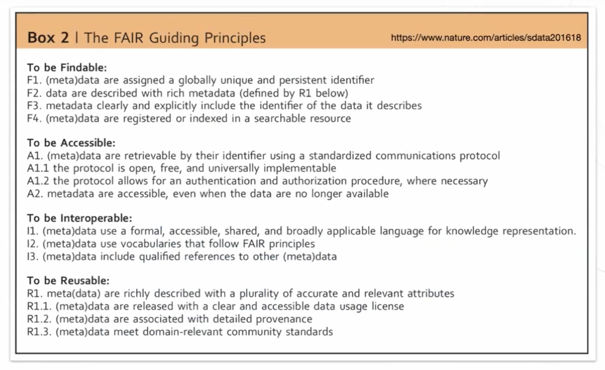
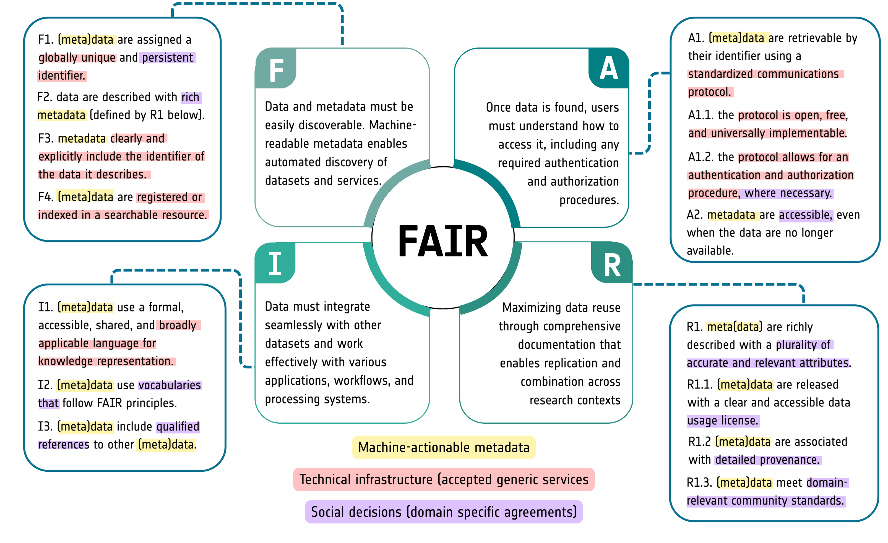

# FAIR and Open Science

## From FAIR Principles to FAIR in Practice

### A Conceptual Overview of FAIR Principles

The FAIR principles (Findable, Accessible, Interoperable, and Reusable) provide a structured approach to managing data, ensuring that both data and processing workflows can be efficiently discovered, accessed, and used across disciplines. Given the increasing volume and complexity of Earth Observation (EO) data—ranging from satellite imagery to in situ measurements—FAIR principles are essential for enabling automated discovery, seamless integration, and reproducible science.

FAIR is not just about data; **software**, **models**, and **workflows** must also be FAIR to ensure full reproducibility of scientific analyses. This requires:

- **FAIR metadata** for software and workflows, ensuring clear documentation of inputs, outputs, dependencies, and provenance.
- **Persistent identifiers (PIDs)** for datasets, algorithms, and workflows to support traceability and reuse.
- **Interoperable formats and standards**, such as netCDF, Zarr, and STAC for data, or CWL (Common Workflow Language) for workflow portability, OGC API - Processes for standardized execution, and openEO for cloud-based EO data processing, ensuring compatibility across platforms.
- **Accessible computing environments**, such as the [cloud-based processing platforms available in EarthCODE](https://esa-earthcode.github.io/documentation/Technical%20Documentation/Working%20With%20Platforms%20and%20Sponsorship/), which allow users to execute EO workflows.

**FAIR does not imply that data or software must be open** by default, but rather that they are well-described, structured, and reusable under appropriate conditions. By applying FAIR principles to both data and processing, the EO community can enhance scientific transparency, improve cross-disciplinary collaboration, and enable scalable, automated analysis—key for addressing global challenges like climate change, disaster response, and biodiversity conservation.

### A Deep Dive into the FAIR Principles
Everyone knows F, A, I, and R, but the FAIR Guiding Principles consist of 15 one-liners that define the key behaviors necessary for making data and services machine-actionable. In this section, we unpack the assumptions implicit in each FAIR Principle and interpret their intentions. We also examine common misconceptions and identify areas not covered by FAIR.

The 15 FAIR Guiding Principles were first defined by Wilkinson et al. (2016) [DOI: 10.1038/sdata.2016.18](https://doi.org/10.1038/sdata.2016.18):

### Metadata, Infrastructure, and Community Agreements

The 15 FAIR principles focus on machine-actionable metadata, but as shown in the figure below, their implementation also depends on technical infrastructure and community-driven agreements.

- **Metadata as the Foundation**: FAIR depends on structured, standardized metadata to enable discovery, accessibility, and interoperability.
- **Technical Infrastructure**: Some principles require persistent identifiers (F1), explicit metadata links (F3), and indexing in searchable resources (F4)—all dependent on well-supported repositories and registries.
- **Community Agreements**: FAIR also involves social decisions—defining "rich metadata" (F2), agreeing on provenance details (R1.2), and adopting domain standards (R1.3).

To move from principles to practice, communities must develop clear, domain-specific FAIR guidelines, align with technical solutions, and establish shared standards. Only through this combined effort can FAIR be effectively implemented in Earth Observation and beyond.

## Interpreting the FAIR Principles for the Earth Observation Community

The FAIR principles provide high-level guidance for ensuring that data, software, and workflows are Findable, Accessible, Interoperable, and Reusable. However, their implementation requires concrete decisions on infrastructure, standards, and governance within specific communities. The Earth Observation (EO) community, including the EarthCODE initiative, follows a FAIR Implementation Profile (FIP) to ensure alignment with these principles.

### Findable
- **F1. (Meta)data are assigned a globally unique and persistent identifier (PID)**
  - **EO Implementation**: DOI (Digital Object Identifier) for datasets, ORCID for researchers, and URIs for workflows and software components.
  - **EarthCODE Choice**: Uses DOI services such as DataCite for data, Zenodo for software, and ORCID for contributor identification.

- **F2. Data are described with rich metadata**
  - **EO Implementation**: INSPIRE metadata profiles, ISO 19115 for geospatial metadata, and STAC for spatiotemporal assets.
  - **EarthCODE Choice**: Uses ISO 19115 and STAC metadata to ensure compliance with international geospatial standards.

- **F3. Metadata include the identifier of the data they describe**
  - **EO Implementation**: Linking datasets with their DOIs and referencing metadata records through PIDs.
  - **EarthCODE Choice**: Ensures STAC and ISO metadata explicitly reference dataset DOIs.

- **F4. (Meta)data are registered or indexed in a searchable resource**
  - **EO Implementation**: Discovery through GEOSS, Copernicus Data Space, and Pangeo catalogs.
  - **EarthCODE Choice**: Registers datasets in the EarthCODE catalog with indexing via STAC and OGC API.

### Accessible
- **A1. (Meta)data are retrievable using a standardized communications protocol**
  - **EO Implementation**: HTTP/HTTPS, OGC API - Features, STAC API.
  - **EarthCODE Choice**: Uses cloud-accessible endpoints, including OGC API and STAC-based search.

- **A1.1 The protocol is open, free, and universally implementable**
  - **EO Implementation**: Publicly available APIs and persistent data access points.
  - **EarthCODE Choice**: Supports open APIs and FAIR-compliant data repositories.

- **A1.2 The protocol allows for an authentication and authorization procedure where necessary**
  - **EO Implementation**: OpenID Connect for authentication, OAuth for access control.
  - **EarthCODE Choice**: Implements OpenID Connect authentication for secure access to protected data.

- **A2. Metadata remain accessible even when the data are no longer available**
  - **EO Implementation**: Persistent metadata records stored in repositories.
  - **EarthCODE Choice**: Ensures metadata is retained in DataCite and STAC even if the data is deprecated.

### Interoperable
- **I1. (Meta)data use a formal, accessible, shared, and broadly applicable language for knowledge representation**
  - **EO Implementation**: JSON-LD, RDF for semantic interoperability.
  - **EarthCODE Choice**: Uses JSON-LD in STAC metadata to enhance machine-actionability.

- **I2. (Meta)data use vocabularies that follow FAIR principles**
  - **EO Implementation**: GCMD Science Keywords, CF Conventions, Climate and Forecast (CF) metadata.
  - **EarthCODE Choice**: Adopts CF Conventions and GCMD for semantic consistency.

- **I3. (Meta)data include qualified references to other (meta)data**
  - **EO Implementation**: Linking datasets via DOI, using provenance standards like PROV-O.
  - **EarthCODE Choice**: Uses PROV-O to link datasets, workflows, and computational steps.

### Reusable
- **R1. (Meta)data are richly described with a plurality of accurate and relevant attributes**
  - **EO Implementation**: Compliance with domain-specific metadata standards (ISO 19115, STAC).
  - **EarthCODE Choice**: Ensures datasets include detailed provenance and descriptive metadata.

- **R1.1. (Meta)data are released with a clear and accessible data usage license**
  - **EO Implementation**: Creative Commons (CC-BY, CC0) for open data, specific licenses for proprietary data.
  - **EarthCODE Choice**: Requires explicit licensing for all datasets and software components.

- **R1.2. (Meta)data are associated with detailed provenance**
  - **EO Implementation**: PROV-O and W3C standards for workflow and data lineage tracking.
  - **EarthCODE Choice**: Uses PROV-O to ensure reproducibility in data processing.

- **R1.3. (Meta)data meet domain-relevant community standards**
  - **EO Implementation**: Compliance with Copernicus, GEO, and OGC standards.
  - **EarthCODE Choice**: Adopts OGC, ISO, and STAC standards for metadata and interoperability.

By adopting a FAIR Implementation Profile (FIP), the EarthCODE community ensures that its approach to FAIR is explicit, actionable, and aligned with best practices in Earth Observation data management and processing. This structured implementation enhances data discoverability, interoperability, and reuse while maintaining technical rigor and community consensus.

### References

- Wilkinson, M., Dumontier, M., Aalbersberg, I. et al. The FAIR Guiding Principles for scientific data management and stewardship. Sci Data 3, 160018 (2016). [DOI: 10.1038/sdata.2016.18](https://doi.org/10.1038/sdata.2016.18)
- FAIR Data Maturity Model Working Group. (2020). FAIR Data Maturity Model. Specification and Guidelines (1.0). Zenodo. [DOI: 10.15497/rda00050](https://doi.org/10.15497/rda00050)
- Annika Jacobsen, Ricardo de Miranda Azevedo, Nick Juty, Dominique Batista, Simon Coles, Ronald Cornet, Mélanie Courtot, Mercè Crosas, Michel Dumontier, Chris T. Evelo, Carole Goble, Giancarlo Guizzardi, Karsten Kryger Hansen, Ali Hasnain, Kristina Hettne, Jaap Heringa, Rob W.W. Hooft, Melanie Imming, Keith G. Jeffery, Rajaram Kaliyaperumal, Martijn G. Kersloot, Christine R. Kirkpatrick, Tobias Kuhn, Ignasi Labastida, Barbara Magagna, Peter McQuilton, Natalie Meyers, Annalisa Montesanti, Mirjam van Reisen, Philippe Rocca-Serra, Robert Pergl, Susanna-Assunta Sansone, Luiz Olavo Bonino da Silva Santos, Juliane Schneider, George Strawn, Mark Thompson, Andra Waagmeester, Tobias Weigel, Mark D. Wilkinson, Egon L. Willighagen, Peter Wittenburg, Marco Roos, Barend Mons, Erik Schultes; FAIR Principles: Interpretations and Implementation Considerations. Data Intelligence 2020; 2 (1-2): 10–29. [DOI: 10.1162/dint_r_00024](https://doi.org/10.1162/dint_r_00024)

## Open Science: A Collaborative and Transparent Approach
Open Science is a movement that promotes transparency, accessibility, and collaboration in scientific research. According to [UNESCO Recommendation on Open Science](https://www.unesco.org/en/open-science/about?hub=686), Open Science encompasses open access to scientific knowledge, open data, open-source software, open workflows and broader participation in research processes.

## Collaboration Tips
A fundamental aspect of Open Science is **sharing while doing**, rather than treating data and publications as an afterthought. The earlier Open Science principles are incorporated into research workflows, the easier they are to implement. This approach enables:

- **Early data sharing**, fostering collaboration and enabling reproducibility.
- **Transparent methodologies**, making research processes more robust and verifiable.
- **Open access to publications and resources**, ensuring that knowledge is freely available to the broader community.

By integrating Open Science with FAIR principles, the EO community can maximize the impact of research, enhance data accessibility, and facilitate cross-domain innovation.

### Collaboration in EarthCODE

Guidance for setting up user permissions, managing team workflows, and collaborating with other researchers within the EarthCODE environment.
