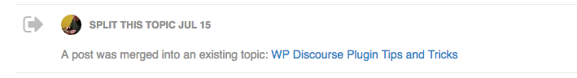
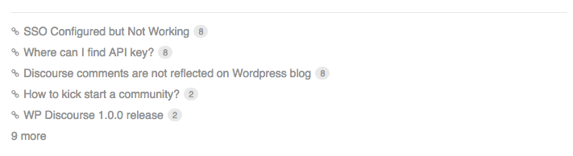

# EarthCODE Discourse Basics

Get started with the EarthCODE Discourse by reading this guide or directly jump in to our [getting started post on Discourse](https://discourse-earthcode.eox.at/t/welcome-to-earthcode-community/5)

## Basic Terms Used by Discourse

Here are some key terms you should be familiar with while using Discourse:

- **Topic**: A series of messages grouped together in a meaningful conversation with a title, listed in a category, beginning with an Original Post, and including all replies in chronological order. This is similar to what other platforms might call a "thread."
- **Post**: An individual message within a topic. Each post can be authored by different users, moved to another topic, or become the start of a new topic.
- **Original Post (OP)**: The first post in any topic. It determines the focus of the topic and is associated with the title and tags.
- **Category**: The primary way of organizing topics. Each topic resides in one category, which can have its own permissions and notification settings. Categories are similar to forums on other sites.
- **Tag**: A marker used to describe a topic. Each topic can have multiple tags and users can create new ones.
- **User**: All site activities, like creating posts and recording actions, are centered around registered users. Discourse sites may be private or public, but registration is required for participation.

> :information_source: For more details, see the [Interface Nomenclature Guide](https://meta.discourse.org/t/interface-nomenclature-guide/103351).

# EarthCODE Discourse Structure

EarthCODE Discourse is organized into categories designed to keep discussions focused and easy to navigate. Each category serves a specific purpose, so it’s important to post your content where it fits best. This helps keep the forum tidy and ensures that others can easily find relevant discussions. 

Before diving in, familiarize yourself with the forum’s [Code of Conduct](https://discourse-earthcode.eox.at/faq). This outlines the expectations for respectful and constructive interactions within the community. 

## EarthCODE Login
First [sign up to the EarthCODE Portal](../../Getting%20started%20with%20EarthCODE/Accessing%20EarthCODE.md) if you haven't done so already. After you have created an account with EarthCODE's Portal you will be able to login to Discourse through EarthCODE's **Single Sign-On (SSO)**, using the same credentials. This is currently managed via your **GitHub account**.

If you are not automatically logged in to Discourse, just click the login button and you’ll be automatically redirected to the central EarthCODE login page. There, you can sign in using your GitHub credentials. Once authenticated, you’ll be returned to the forum and logged in automatically.

When you log in, you’ll find the following categories in Discourse: 

## EarthCODE Forum Categories

| **Category**                | **Purpose**                                                     |
|-----------------------------|-----------------------------------------------------------------|
| **General Discussion**      | Introductions, announcements, Q&A                              |
| **Science Clusters & Working Groups** | Domain-specific research discussions                         |
| **EarthCODE Architecture**  | Technical standards and development                            |
| **Technical Support**       | Technical support for EarthCODE and platforms                 |
| **Training and Resources**  | Tutorials and best practices                                   |
| **Data & Workflows**        | Dataset and workflow discussions (autogenerated from the Open Science Catalog) |
| **Community Engagement**    | Events and recognition                                         |
| **Feedback and Suggestions**| Feedback on how to improve EarthCODE                          |

## Topic Lists

By default, the Discourse homepage shows all **Latest** conversations, but you can filter this list in several ways:

- **By category**: Click the 'all categories' title to see a list of all categories:
- **By tag**: Click the 'all tags' title to see a list of all tags.
- **By activity level**: Click 'Top' to list topics by activity level for a specific time period.
- **By new topics**: New topics (created in the last 2 days that you haven’t opened) are marked with a small blue dot:
  
- **By unread topics**: Topics that you've opened and read for at least 4 minutes but have new posts (replies) are marked with a number in the blue circle:
  

## See Who's Participating

On the homepage, you can see avatars of:

- The user who started the topic
- The most active participants
- The user who created the most recent post
- If the original poster is also the most recent poster, the first photo has a blue border or halo

Indicators at the bottom of the OP show who created the post, the count of replies, and views, and the avatars of the most frequent participants:

## Navigation Tools

Use the **icon buttons at the upper right** for the chat, search, or your user menu:

---

# Reading Topics

## Keep Scrolling

Click on a topic title to read replies in chronological order. Use your mouse or the timeline scroll bar on the right to navigate through the conversation. On smaller screens, select the bottom progress bar to expand it.

## Jump Back In

Selecting a topic title takes you to your **last read post**. To enter at the top or bottom, click the reply count or last reply date:

- Topics above the light red line are new or updated since your last visit.
- Fully read topics have light grey titles:
  
<!-- 
## Related Topics

Posts can be moved to more appropriate topics, or two related topics can be merged. A link will appear allowing readers to jump to the new location. Related topics are listed at the end of the OP:

 -->

---

# Actions and Reactions

At the bottom of each post, you will find action buttons:

- **Like**: Show appreciation for the post.
- **Link**: Copy a permalink to the reply or topic.
- The "**…**" button will show more actions, such as **Flag**, **Edit**, and **Bookmark**:

---
## Notifications

When someone interacts with you directly, a blue number will appear over your profile picture. For personal messages, a green envelope will appear instead. To receive desktop or Android push notifications, allow the site to send you notifications through your browser.

{width=400px}

### Topic Notifications

Change notification level for any topic via the notification control at the bottom of the topic:

 or on the timeline on the right:
{width=400px}

### Category Notifications

Set notification levels per category from your user preferences or the category page:

### Tag Notifications

Set notification levels per tag via your user preferences (Under "Tracking"):

If you are on a category or tag on which you have set a notification setting, you can change it by clicking the bell icon next to the New Topic button:

---
<!-- taken and edited from: https://meta.discourse.org/t/understanding-discourse-for-new-users/96331 -->
